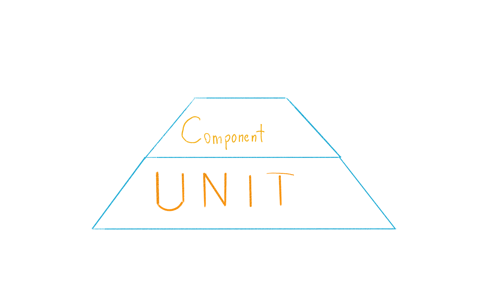
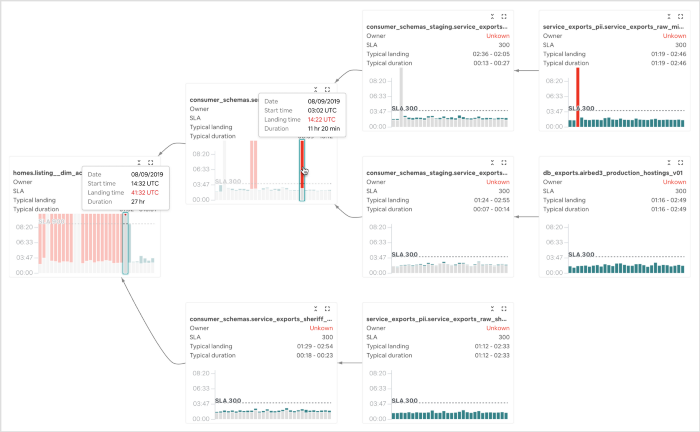

<!--
_class: lead
_paginate: false
_footer: ""
-->

<style>
footer {
    display: table
}
.hljs-variable { color: lightblue }
.hljs-string { color: lightgreen }
.hljs-params { color: lightpink }
</style>

# Himalayan Peaks
## of Testing Data Pipelines

Ksenia Tomak, Dodo Engineering
Pasha Finkelshteyn, JetBrains

---

# Who we are

---

# What is Big Data

---

# Who are DEs?

---

# What is pipeline?

---

# Who needs pipelines

---

# QA of pipeline

QA ?= QC

---

# QA of pipeline

QA ≠ QC

QA is about processes, and not only about software quality.

---

# Pyramid of testing. Unit


---

# Typical pipeline


---

# Unit testing of pipeline

What may we test here?

A pipeline should transform data correctly!

_Correctness is a business term_

---

# Let's paste fakes!


Fake/mock input data
Reference data at the end of pipeline

---

# Tools

[holdenk/spark-testing-base](https://github.com/holdenk/spark-testing-base) ← Tools to run tests
[MrPowers/spark-daria](https://github.com/MrPowers/spark-daria) ← tools to easily create test data

---

# Component testing



---


---

# TestContainers


---

# TestContainers

Supported languages:

* Java (and compatibles: Scala, Kotlin, etc.)
* Python
* Go
* Node.js
* Rust
* .NET

---

# Test Containers
```python
import sqlalchemy
from testcontainers.mysql import MySqlContainer

with MySqlContainer('mysql:5.7.17') as mysql:
    engine = sqlalchemy.create_engine(mysql.get_connection_url())
    version, = engine.execute("select version()").fetchone()
    print(version)  # 5.7.17
```

---

# Integration Tests

Why test containers are not enough?

* vendor lock tools (DB, processing, etc.)
* real data
* external error handling

---
<!-- 20 -->
# Integration Tests: How to

* get data samples from prod, anonymize it
* deploy full data backup on stage, depersonalize it ($$$)
* run parallel job with different sink

<!--_footer: '[Using production data for testing in a post GDPR world](https://www.sqlshack.com/using-production-data-testing-post-gdpr-world/)

@asm0di0 &emsp13;&emsp13;@if_no_then_yes'-->

---
# Data expectations

Test:
 no data
 valid data
 empty partitions
 &nbsp;invalid data
 &nbsp;illegal data format

---

# Data expectations. Tools: 
- [great expectations](https://greatexpectations.io/),
- [Deequ](https://github.com/awslabs/deequ)

--- 

 
Use Dead letter queue pattern for broken data 
to prevent:
- data loss
- data traffic jam

---
# Monitoring 

Why?

How to collect:
* StreamingQueryListener, QueryExecutionListener 
* foreachBatch aggregates, sink as logs

--- 
# Monitoring visualization



[Visualizing Data Timeliness](https://medium.com/airbnb-engineering/visualizing-data-timeliness-at-airbnb-ee638fdf4710)

---
# End-to-End tests

Compare with reports, old DWH

Multiple dimentions:
* data
* data latency
* performance, scalability

---

# Performance Tests

Best performance test - initial data load

(image with initial data load + next microbatches loading)
