<!--
_class: lead
_paginate: false
_footer: ""
-->

<style>
footer {
    display: table
}
.hljs-variable { color: lightblue }
.hljs-string { color: lightgreen }
.hljs-params { color: lightpink }
</style>

# Himalayan Peaks
## of Testing Data Pipelines

Ksenia Tomak, Dodo Engineering
Pasha Finkelshteyn, JetBrains

---

# Who we are

---

# What is Big Data

---

# Who are DEs?

---

# What is a pipeline?

---

# Who needs pipelines

---

# QA of pipeline

QA ?= QC

---

# QA of pipeline

QA ≠ QC

QA is about processes and not only about software quality.

---

# Pyramid of testing. Unit


---

# Typical pipeline

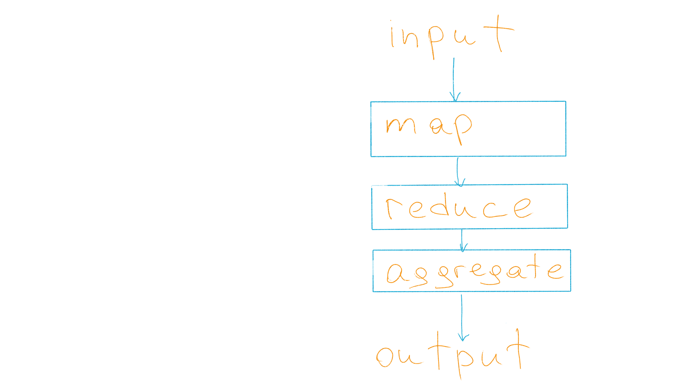

---

# Unit testing of pipeline

What may we test here?

A pipeline should transform data correctly!

_Correctness is a business term_

---

# Let's paste fakes!

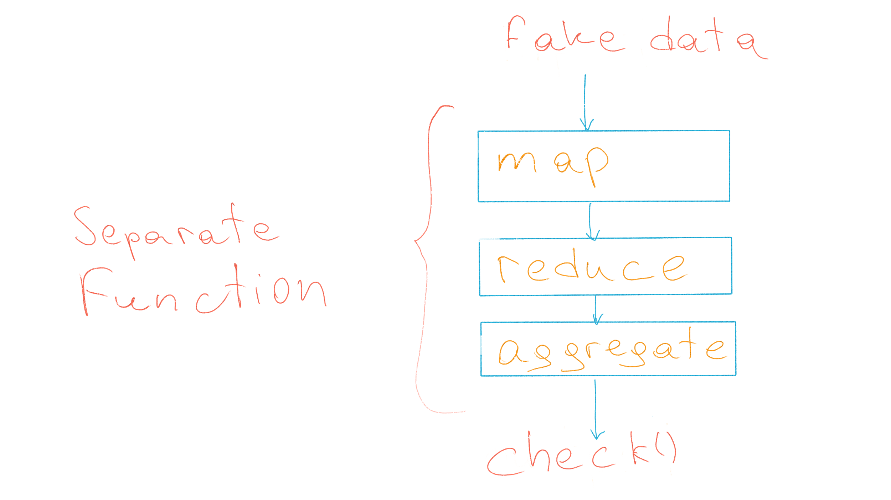

Fake/mock input data
Reference data at the end of the pipeline

---

# Tools

[holdenk/spark-testing-base](https://github.com/holdenk/spark-testing-base) ← Tools to run tests
[MrPowers/spark-daria](https://github.com/MrPowers/spark-daria) ← tools to easily create test data

---

# Component testing

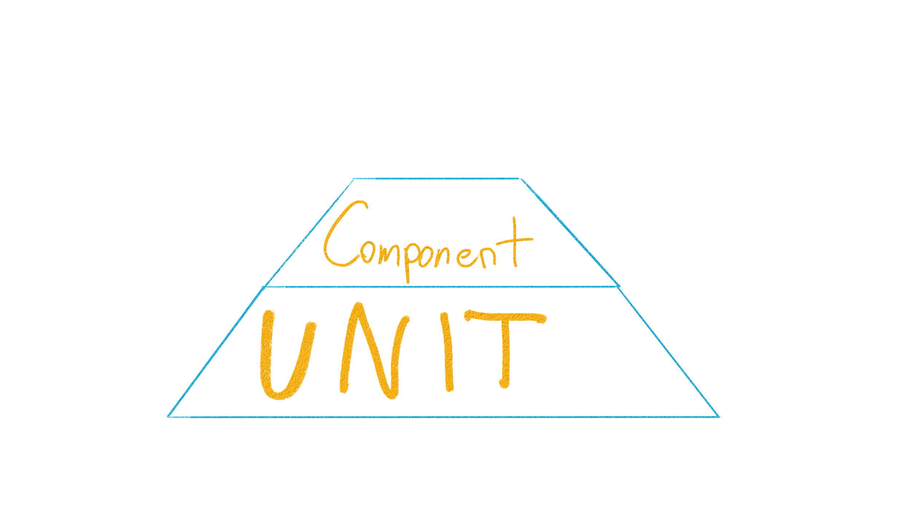

---


---

# TestContainers

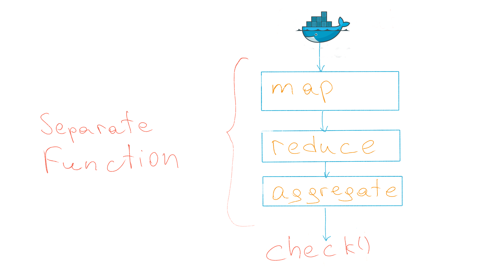


---

# TestContainers

Supported languages:

- Java (and compatibles: Scala, Kotlin, etc.)
- Python
- Go
- Node.js
- Rust
- .NET

---

# Test Containers
```python
import sqlalchemy
from testcontainers.mysql import MySqlContainer

with MySqlContainer('mysql:5.7.17') as mysql:
    engine = sqlalchemy.create_engine(mysql.get_connection_url())
    version, = engine.execute("select version()").fetchone()
    print(version)  # 5.7.17
```

---

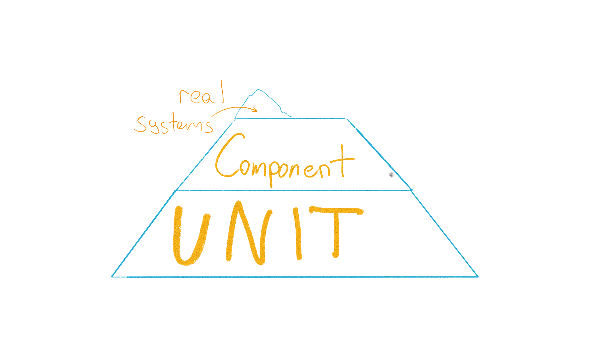

---
<!-- Integration: от начала до конца пайплайна -->
# Real systems

Why are component tests not enough?

- vendor lock tools (DB, processing, etc.)
- external error handling

<!-- TODO: KSU deploy dev servers/instances, Azure SQL specific errors,
Pasha pics-->

---


---

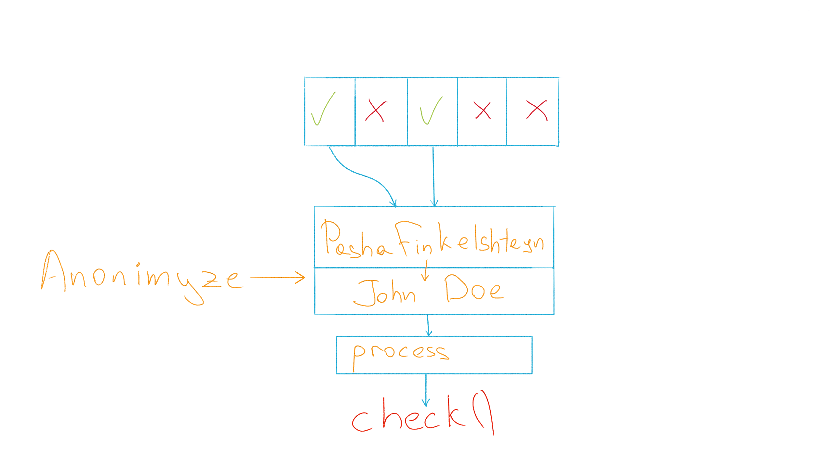

# Real data
<br/>

- get data samples from prod
- anonymize it

---

# Compare to reference

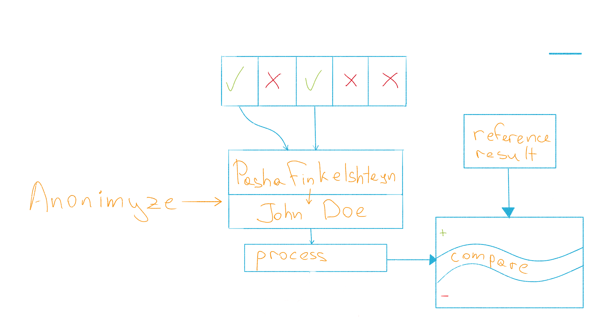

<!-- TODO: compare with reference sample -->

---
# Real data expectations
Test:
✅ no data
✅ valid data
❓ invalid data
❓ illegal data format

+ Property-based testing

---
<!-- TODO: rearrange -->

# Real data expectations. Tools: 
- [great expectations](https://greatexpectations.io/),
- [Deequ](https://github.com/awslabs/deequ)

<!-- 
_footer: '[Automated Testing For Protecting Data Pipelines from Undocumented Assumptions
](https://databricks.com/session_na20/automated-testing-for-protecting-data-pipelines-from-undocumented-assumptions)'
-->

---
```Python
from pyspark.sql.types import Row, StructType
from datetime import datetime

schema = {
  "type": "struct",
  "fields": [
    {"name": "Id", "type": "long", "nullable": False, "metadata": {}},
    {"name": "SaleDate", "type": "timestamp", "nullable": False, "metadata": {}},
    {"name": "Country", "type": "string", "nullable": False, "metadata": {}},
  ]
}

table_rows = [
        Row(1, datetime(2021, 1, 1, 10, 0, 0), "RU" ),
        Row(2, datetime(1000, 1, 1, 10, 0, 0), "KZ"),
        Row(2, datetime(2018, 1, 1, 10, 0, 0), "AU"),
        Row(2, datetime(2019, 1, 1, 10, 0, 0), ""),
    ]

sample_df = spark.createDataFrame(table_rows, StructType.fromJson(schema))
```
---
## Great expectations
```python
from great_expectations.dataset.sparkdf_dataset import SparkDFDataset

ge_sample_df = SparkDFDataset(sample_df)
ge_sample_df.expect_column_values_to_be_in_set("Country", ["RU", "KZ"])
```
---

## Great expectations
```json
{
  "result": {
    "element_count": 4,
    "unexpected_count": 2,
    "unexpected_percent": 50.0,
    "partial_unexpected_list": ["AU",""]
  },
  "success": false,
  "expectation_config": {
    "kwargs": {
      "column": "Country",
      "value_set": ["RU", "KZ"]
    }
  }
}
```
---
## Python Deequ
```python
# No Spark 3.0 support yet
from pydeequ.checks import *
from pydeequ.verification import *

check = Check(spark, CheckLevel.Warning, "Country Check")
checkResult =(
  VerificationSuite(spark)
    .onData(sample_df)
    .addCheck(
        check.isContainedIn("Counrty", ["RU","KZ"]))
   .run()
)  
checkResult_df = VerificationResult.checkResultsAsDataFrame(spark, checkResult)
checkResult_df.show()
```
<!-- 
_footer: '
[Testing data quality at scale with PyDeequ
](https://aws.amazon.com/blogs/big-data/testing-data-quality-at-scale-with-pydeequ/)'
-->

---


---

# Monitoring 

**Why?**

- The only REAL testing is production
- Data tends to change over time

<!-- TODO: -->

---

# Monitoring 

What?
- data volumes
- counters
- time
- dead letter queue monitoring

<!-- TODO: prepare examples -->


---

# Monitoring 

How?
- use Listeners
- use data aggregations

---

<!-- 
_color: black
_backgroundImage: "linear-gradient(to bottom, #fff 0%, #fff 100%)"
_footer: '[Visualizing Data Timeliness](https://medium.com/airbnb-engineering/visualizing-data-timeliness-at-airbnb-ee638fdf4710)'
-->

### Monitoring visualization

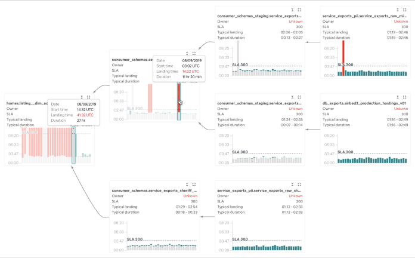

---
# End-to-End tests

Compare with reports, old DWH

Multiple dimensions:
- data
- data latency
- performance, scalability

---

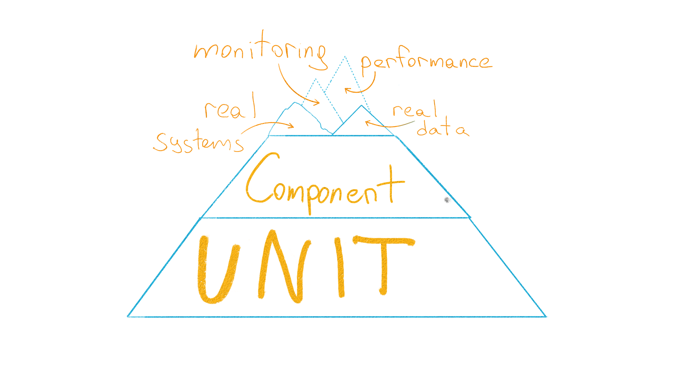

---

# Performance Tests

<br/>
<br/>
<br/>
<br/>

- Start with SLA
- Best performance test - initial data load

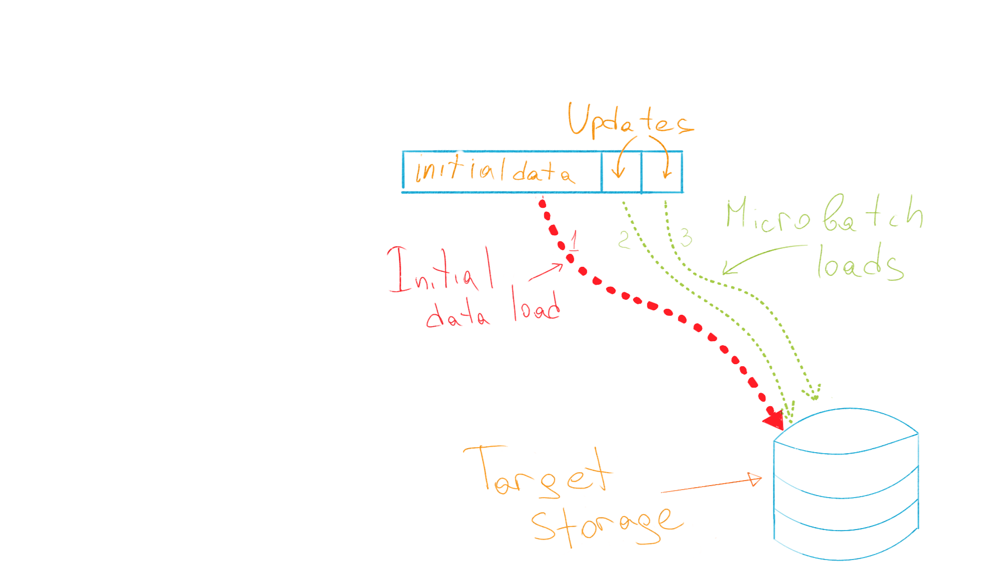

---
<!-- _class: lead -->
# How to apply?

---

# Real data, real system

Deploy full data backup on stage env, anonymize it :money_mouth_face:

---

# Real prod

<br/>
Run a parallel job with a different sink

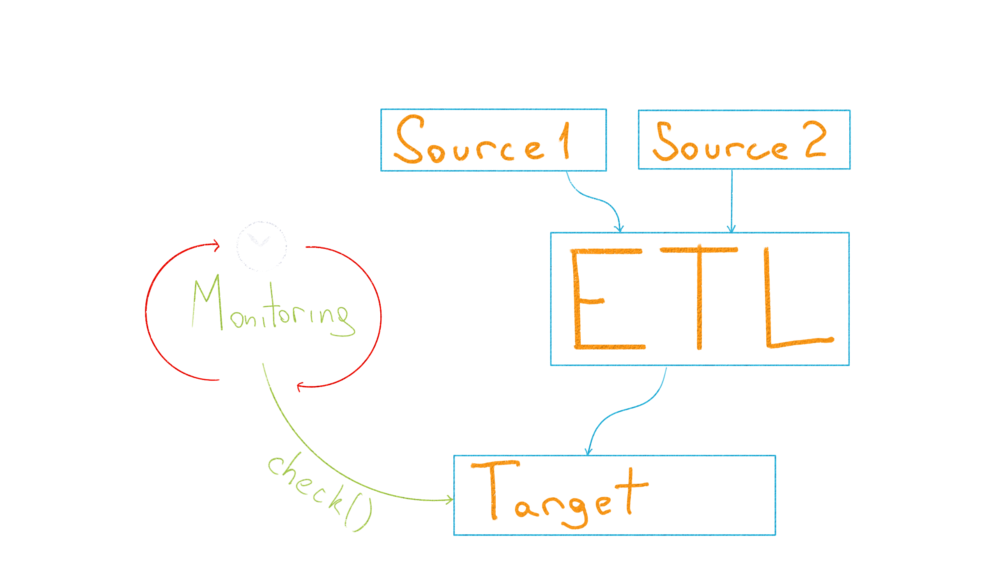

<!--_footer: '@asm0di0 &emsp13;&emsp13;@if_no_then_yes

[Using production data for testing in a post GDPR world](https://www.sqlshack.com/using-production-data-testing-post-gdpr-world/)'-->

