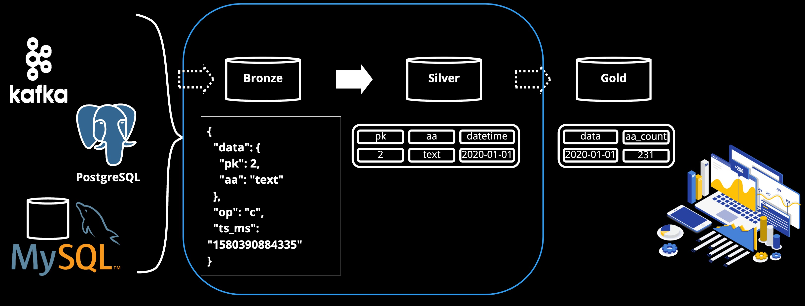
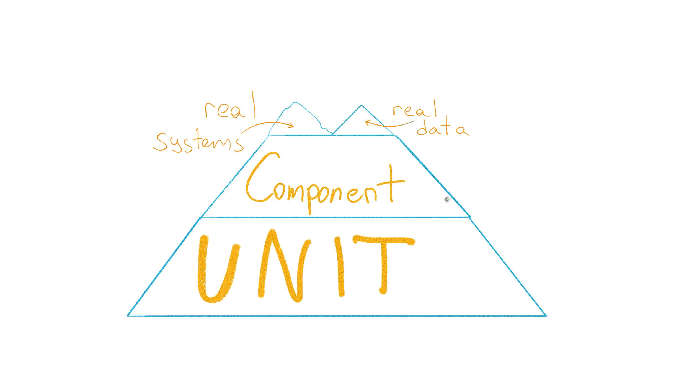
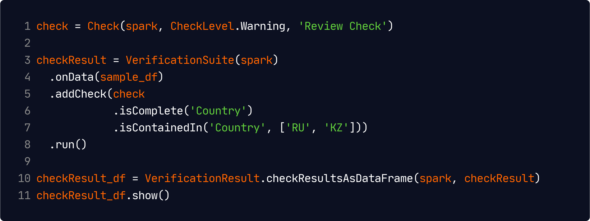
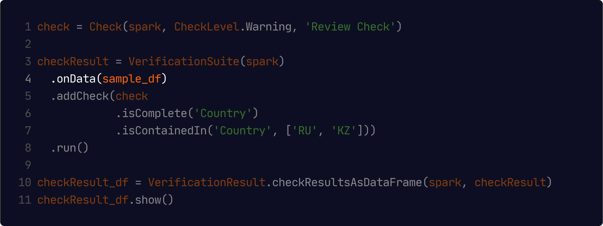
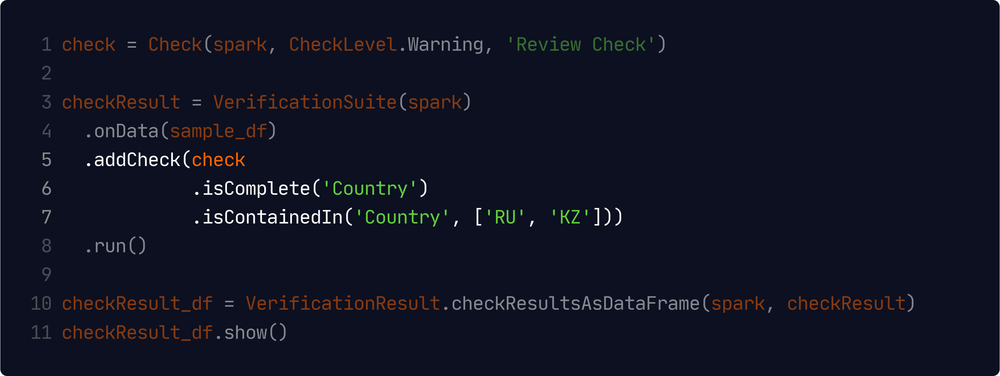
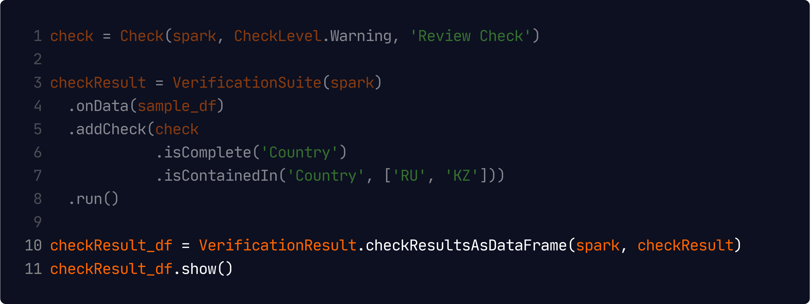
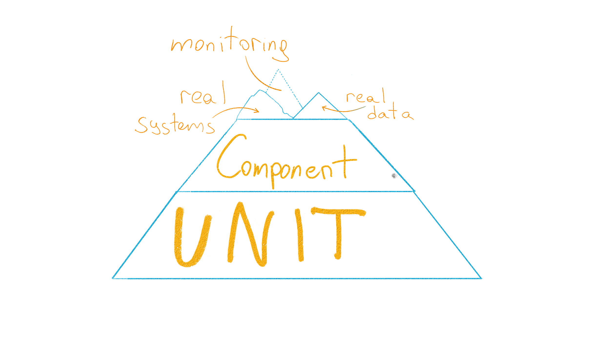

<!--
_class: lead
_paginate: false
_footer: ""
-->

# Himalayan Peaks
## of Testing Data Pipelines

Ksenia Tomak, Dodo Engineering
Pasha Finkelshteyn, JetBrains

---

# Ksenia Tomak

- Tech Lead, Dodo Engineering
- @if_no_then_yes

Industrial IoT, DE, Storages

---
<!-- _class: lead -->
# Pasha Finkelshteyn

Developer :avocado: for Big Data @ JetBrains

@asm0di0

---

# What is Big Data

* Doesn't fit the single node (or Excel)
* Maybe scaled when growing
* Enough data to make reliable business solutions

<!-- 3V: volume, velocity, variety -->

---

# Who are DEs

Plumber of data

Data is produces by 
- sensors
- clickstreams
- etc.

---

# Data sinks

- HDFS
- S3, Azure Blob Storage
- etc.

---
<!-- _class: lead -->
# What is a data pipeline?

---
<!-- _class: lead -->
# Data processing

---
<!-- _backgroundImage: "linear-gradient(to bottom, #000, #000)" -->

# Data lake?

---

# Who needs pipelines

- Data Scientists
- Data Analytics
- Marketing
- PO

---

<!-- _class: lead -->
# <!-- fit --> QA ?= QC

---

<!-- _class: lead -->
# <!-- fit --> QA ≠ QC

QA is about processes and not only about software quality.

---

# Pyramid of testing. Unit

---

<!-- _backgroundImage: "linear-gradient(to bottom, #000, #000)" -->

# Bronze→Silver pipeline

---

# Typical pipeline

---
# Typical pipeline

---
# Typical pipeline

---
# Typical pipeline

---
# Typical pipeline

---
# Typical pipeline

---

# Unit testing of pipeline

What may we test here?

A pipeline should transform data correctly!

_Correctness is a business term_

---

# Let's paste fakes!

Fake input data
Reference data at the end of the pipeline

---

# Tools

[holdenk/spark-testing-base](https://github.com/holdenk/spark-testing-base) ← Tools to run tests
[MrPowers/spark-daria](https://github.com/MrPowers/spark-daria) ← tools to easily create test data

---

# Component testing

---

---

# TestContainers

---

# TestContainers

Supported languages:

- Java (and compatibles: Scala, Kotlin, etc.)
- Python
- Go
- Node.js
- Rust
- .NET

---

# Test Containers

---

# Test Containers

---

# Test Containers

---

---

<!-- _backgroundImage: #FFFFFF -->
)

---
# Real systems

Why are component tests not enough?

- vendor lock tools (DB, processing, etc.)
- external error handling

---

---

# Real data
 

Get data samples from prod, 
anonymize it

---

# Compare to reference

---

# Real data

Deploy full data backup on stage env,
anonymize it :money_mouth_face:

---

<!-- _class: lead -->
# <!-- fit --> In usual testing you won't trust your code

---
<!-- _class: lead -->

# <!-- fit --> In pipeline testing  you won't trust 
# <!-- fit --> both your code and your data

---
# Real data expectations
Test:
✅ no data
✅ valid data
❓ invalid data
❓ illegal data format

---

# Real data expectations. Tools: 
- [great expectations](https://greatexpectations.io/),
- [Deequ](https://github.com/awslabs/deequ)

<!-- 
_footer: '[Automated Testing For Protecting Data Pipelines from Undocumented Assumptions
](https://databricks.com/session_na20/automated-testing-for-protecting-data-pipelines-from-undocumented-assumptions)'
-->

---

## Real data expectations

- profilers
- constraint suggestions
- constraint verification
- metrics
- metrics strores
---

---

---

---

---
## Great expectations

---

## Great expectations

---
## Python Deequ

<!-- 
_footer: '
[Testing data quality at scale with PyDeequ
](https://aws.amazon.com/blogs/big-data/testing-data-quality-at-scale-with-pydeequ/)

[PyDeequ documentation](https://pydeequ.readthedocs.io/_/downloads/en/latest/pdf/)'
-->

---
## Python Deequ

<!-- 
_footer: '
[Testing data quality at scale with PyDeequ
](https://aws.amazon.com/blogs/big-data/testing-data-quality-at-scale-with-pydeequ/)

[PyDeequ documentation](https://pydeequ.readthedocs.io/_/downloads/en/latest/pdf/)'
-->

---
## Python Deequ

<!-- 
_footer: '
[Testing data quality at scale with PyDeequ
](https://aws.amazon.com/blogs/big-data/testing-data-quality-at-scale-with-pydeequ/)

[PyDeequ documentation](https://pydeequ.readthedocs.io/_/downloads/en/latest/pdf/)'
-->

---
## Python Deequ

<!-- 
_footer: '
[Testing data quality at scale with PyDeequ
](https://aws.amazon.com/blogs/big-data/testing-data-quality-at-scale-with-pydeequ/)

[PyDeequ documentation](https://pydeequ.readthedocs.io/_/downloads/en/latest/pdf/)'
-->

---
## Python Deequ.

constraint | constraint_status | constraint_message
-----|------|:-----:
CompletenessConstraint | Success |  
ComplianceConstraint | Failure | Value: 0.5 does not meet the constraint requirement!

---
## Real data ecpectations. Use cases

* pre-ingestion and post-ingestion data validaton
* before pipeline development
* monitoring and alerting

---

---

# Monitoring 

**Why?**

- The only REAL testing is production
- Data tends to change over time

---

# Monitoring 

What?
- data volumes
- counters
- time
- dead letter queue monitoring
- service health
- business metrics

---

# Monitoring 

How?
- use Listeners
- use data aggregations

---
<!-- _class: lead -->
# Data pipelines is always DAG
Monitoring should visualize it
<!-- Specifics of data pipeline monitoring -->

---

<!-- 
_color: black
_backgroundImage: "linear-gradient(to bottom, #fff 0%, #fff 100%)"
_footer: '[Visualizing Data Timeliness](https://medium.com/airbnb-engineering/visualizing-data-timeliness-at-airbnb-ee638fdf4710)'
-->

### Monitoring visualization

---
# End-to-End tests

Compare with reports, old DWH

Multiple dimensions:
- data
- data latency
- performance, scalability

---

---

# Performance Tests

 
 
 
 

- start with SLO
- test your initial data load

---

# Real prod

 
Run a parallel job with a different sink

<!--_footer: '@asm0di0 &emsp13;&emsp13;@if_no_then_yes

[Using production data for testing in a post GDPR world](https://www.sqlshack.com/using-production-data-testing-post-gdpr-world/)'-->

---

---

# Summary

* Testing pipeline is like testing code
* Testing pipelines is not like testing code
* Pipeline quality is not only about testing
* Sometimes testing outside of production is tricky

---

<!-- 
_class: lead
_footer: ""
 -->

# Thanks!
## Questions? :bow:

@asm0di0
@if_no_then_yes